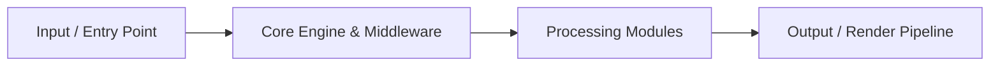

# Advanced-Inventory-Management-System

Inventory control platform for tracking products, stock levels, movements and operational workflows.

    


## 📖 Table of Contents

- [Overview](#-overview)
- [Architecture & Workflow](#-architecture--workflow)
- [Features](#-features)
- [Tech Stack](#-tech-stack)
- [Quick Start & Installation](#-quick-start--installation)
- [Environment Variables](#-environment-variables)
- [Project Structure](#-project-structure)
- [Scripts & Commands](#-scripts--commands)
- [Contributing](#-contributing)
- [License](#-license)


## 🚀 Overview

**Advanced-Inventory-Management-System** is an engineered solution built with JavaScript, CSS, PHP.

- **Repository**: [`linuxsujith-lab/Advanced-Inventory-Management-System`](https://github.com/linuxsujith-lab/Advanced-Inventory-Management-System)
- **Default Branch**: `main`
- **Primary Runtime**: JavaScript (80%), CSS (14.3%), PHP (5.7%), Shell (0%)


## 🏗️ Architecture & Workflow




## ✨ Key Features

- ⚡ **High Performance Architecture**: Optimized execution lifecycle built on JavaScript.
- 🛡️ **Ground-Truth Data Integrity**: Built with resilient state validation and type-safe interfaces.
- 🧩 **Modular Subsystem Design**: Clean decoupling of UI components, service abstractions, and data transformations.
- 🎨 **Responsive & Intuitive Interface**: Engineered for frictionless user experience across desktop and mobile.
- 🚀 **Zero-Config Deployment Ready**: Pre-configured build scripts and modern containerization support.


## 💻 Tech Stack

| Technology | Category | Role |
| :--- | :--- | :--- |
| **JavaScript** | `other` | Core application framework & tooling |
| **CSS** | `other` | Core application framework & tooling |
| **PHP** | `other` | Core application framework & tooling |


## ⚡ Quick Start & Installation

### Prerequisites

Ensure you have the verified runtime installed on your machine:
- **NPM** (v18+ or compatible runtime)
- **Git**

### Step-by-Step Setup

1. **Clone the repository:**
   ```bash
   git clone https://github.com/linuxsujith-lab/Advanced-Inventory-Management-System.git
   cd Advanced-Inventory-Management-System
   ```

2. **Install dependencies:**
   ```bash
   npm install
   ```

3. **Configure environment variables:**
   ```bash
   cp .env.example .env
   # Populate your secrets and keys in .env
   ```

4. **Launch development server:**
   ```bash
   npm run dev
   ```


## 📂 Project Structure

```plaintext
.
├── Licenses
│   ├── AdminLte license.txt
│   ├── laravel license.txt
│   └── twitterbootstrap-License.txt
├── README.md
├── ReleaseNotes
│   ├── StockAwesome_v4.0.3.docx
│   ├── StockAwesome_v4.0.5.docx
│   └── StockAwesome_v4.0.6.docx
├── Translations
│   ├── Category.xlsx
│   ├── Customer.xlsx
│   ├── Dispatch.xlsx
│   ├── Invoice.xlsx
│   ├── Payment.xlsx
│   ├── Product.xlsx
│   ├── SalesOrder.xlsx
│   ├── Sidebar.xlsx
│   ├── Staff.xlsx
│   ├── Trans_Doc.xlsx
│   ├── department.xlsx
│   ├── order.xlsx
│   ├── restock.xlsx
│   ├── supplier.xlsx
│   ├── user.xlsx
│   ├── warehouse.xlsx
│   └── ~$Trans_Doc.xlsx
├── artisan
├── build.xml
├── composer.json
├── composer.lock
├── database
│   ├── factories
│   │   ├── CustomerFactory.php
│   │   ├── InvoiceFactory.php
│   │   ├── ModelFactory.php
│   │   ├── ProductFactory.php
│   │   ├── PurchaseOrderFactory.php
│   │   ├── SalesOrderFactory.php
│   │   ├── SupplierFactory.php
│   │   └── WarehouseFactory.php
│   ├── migrations
│   │   ├── 2014_10_12_000000_create_users_table.php
│   │   ├── 2014_10_12_100000_create_password_resets_table.php
```


## 🤝 Contributing

Contributions, issues, and feature requests are welcome!

1. Fork the Project
2. Create your Feature Branch (`git checkout -b feature/AmazingFeature`)
3. Commit your Changes (`git commit -m 'feat: add amazing feature'`)
4. Push to the Branch (`git push origin feature/AmazingFeature`)
5. Open a Pull Request


## 📄 License

Distributed under the **MIT License**. See `LICENSE` for more information.

---

<div align="center">
  <sub>Engineered with precision by <a href="https://github.com/linuxsujith-lab/Advanced-Inventory-Management-System">linuxsujith-lab/Advanced-Inventory-Management-System</a></sub>
</div>
